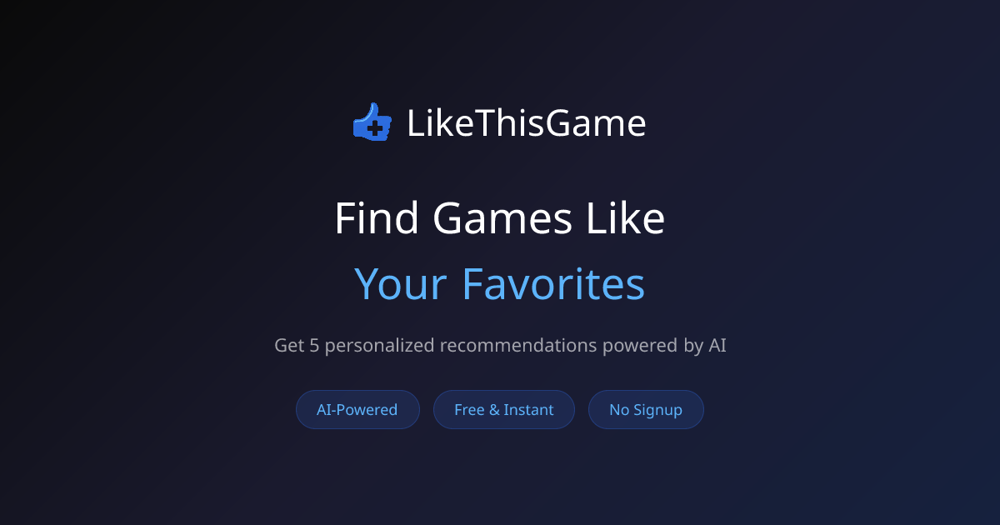
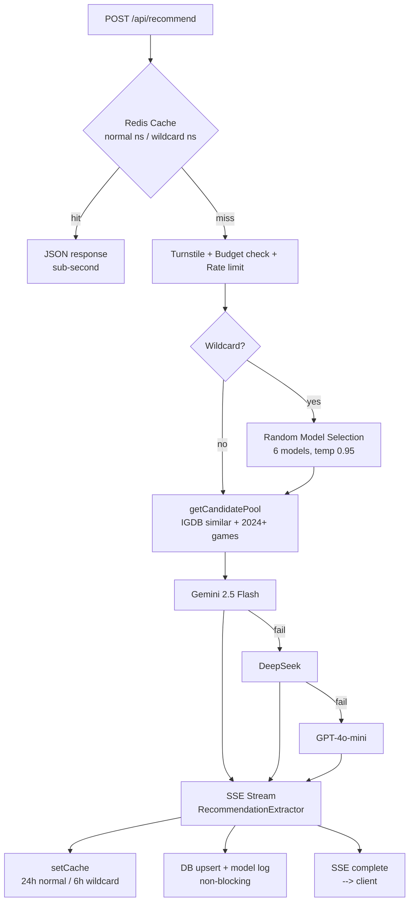

# likethisgame.com

**Find games you'll love. AI-powered recommendations based on games you enjoy.**

[Live Site](https://likethisgame.com)

## What is LikeThisGame?

Search for any game and get AI-powered recommendations for similar titles. Built on IGDB's database with real-time SSE streaming, multi-model AI fallback, and a 5-layer cost protection system.

## Stats

| Metric | Value |
|--------|-------|
| Games in database | 33,300+ |
| Recommendation records | 15,600+ |
| Games with recommendations | 15,600+ |
| Test coverage | 20 files, 494 tests |
| Top-tier coverage (500+ ratings) | 99%+ (348/350) |

## Tech Stack

| Layer | Technology |
|-------|-----------|
| Framework | Next.js 16 (App Router, standalone) |
| UI | React 19 + Tailwind CSS v4 |
| Database | SQLite (better-sqlite3, WAL mode) |
| ORM | Drizzle ORM |
| Cache | Redis (ioredis) + circuit breaker |
| AI (primary) | Gemini 2.5 Flash (via OpenRouter) |
| AI (fallback chain) | Gemini direct → DeepSeek → GPT-4o-mini |
| AI (wildcard mode) | Random model per request (Gemini, GPT-4o-mini, Llama 4 Maverick, Grok 3 Mini, Claude 3 Haiku, DeepSeek) |
| Game Data | IGDB API |
| Security | Cloudflare Turnstile + FingerprintJS v5 |
| Monitoring | Sentry + Umami Cloud + Clarity |
| Observability | Grafana + Prometheus + Loki + Promtail |
| Hosting | Hetzner CX33 + Coolify + Cloudflare CDN |

## Architecture

## Notable Engineering Decisions

- **SSE streaming with custom JSON parser**: `RecommendationExtractor` does character-by-character brace-depth tracking to yield each recommendation object as soon as the AI completes it, not waiting for the full response.
- **Circuit breaker on Redis**: 3-state (closed/open/half-open), 3 failures → open, 30s reset. Redis down doesn't crash the app; it degrades gracefully.
- **5-layer cost protection**:
  1. Sliding window rate limit (Lua script, IP + fingerprint)
  2. Daily AI budget (atomic Redis INCR, default 200 req/day)
  3. Criteria combo dedup (8 unique combos/IP/hour via SHA-256)
  4. Anomaly detection (>5 fingerprints/IP/hour → block)
  5. Cloudflare Turnstile (invisible CAPTCHA, only on cache miss)
- **4-model AI fallback chain**: OpenRouter Gemini → Direct Gemini → DeepSeek → GPT-4o-mini. Each provider uses the same OpenAI SDK with `baseURL` override.
- **Wildcard mode**: Randomly selects from 6 AI models (Gemini, GPT-4o-mini, Llama 4 Maverick, Grok 3 Mini, Claude 3 Haiku, DeepSeek) per request with elevated temperature (0.95 vs 0.50). Custom system prompt overrides force cross-genre recommendations. Separate cache namespace (6h TTL vs 24h) and client-side cache isolation so normal/wildcard results don't interfere. Model name logged per request for quality analysis.
- **Organic database growth**: Googlebot's crawl chains trigger IGDB lookups for unknown games, passively expanding the database from 24K to 33K+.
- **Programmatic SEO**: ISR pages with JSON-LD (VideoGame + ItemList + FAQPage), 3-part sitemap, IndexNow for Bing/Yandex.
- **Full observability stack**: Grafana dashboards + Prometheus metrics (4 exporters, 9 alert rules) + Loki log aggregation with Promtail (Docker service discovery, 14-day retention). All behind Cloudflare Tunnel + Access.

## Source Code

Source code is in a private repository. This repo serves as a public project overview.

## Author

**Mehmet Aras** — Senior Frontend Engineer
- [arasmehmet.com](https://arasmehmet.com)
- [LinkedIn](https://linkedin.com/in/arasmehmet7)
