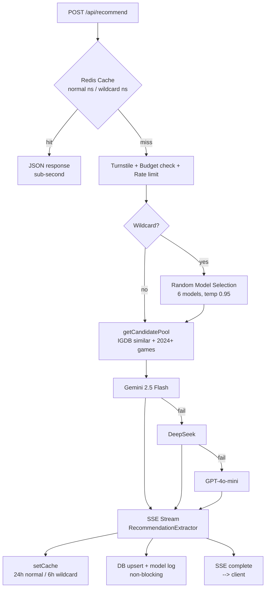

# likethisgame.com

**Find games you'll love. AI-powered recommendations based on games you enjoy.**

[Live Site](https://likethisgame.com)

## What is LikeThisGame?

Search for any game and get AI-powered recommendations for similar titles. Built on IGDB's database with real-time SSE streaming, multi-model AI fallback, and a 5-layer cost protection system.

## Stats

| Metric | Value |
|--------|-------|
| Games in database | 34,000+ |
| Recommendation records | 15,900+ |
| Games with recommendations | 15,900+ |
| Test coverage | 20 files, 494 tests |
| Top-tier coverage (500+ ratings) | 99.7% (349/350) |

## Tech Stack

| Layer | Technology |
|-------|-----------|
| Framework | Next.js 16 (App Router, standalone) |
| UI | React 19 + Tailwind CSS v4 |
| Database | SQLite (better-sqlite3, WAL mode) |
| ORM | Drizzle ORM |
| Cache | Redis (ioredis) + circuit breaker |
| AI (production) | Gemini 2.5 Flash via OpenRouter |
| AI (alternates) | Direct Gemini, DeepSeek, OpenAI — env-swappable |
| AI (wildcard mode) | Random model per request (Gemini, GPT-4o-mini, Llama 4 Maverick, Grok 3 Mini, Claude 3 Haiku, DeepSeek) |
| Game Data | IGDB API |
| Security | Cloudflare Turnstile + FingerprintJS v5 |
| Monitoring | Sentry + Umami Cloud + Clarity |
| Observability | Grafana + Prometheus + Loki + Promtail |
| Hosting | Hetzner CX33 + Coolify + Cloudflare CDN |

## Architecture

## Notable Engineering Decisions

- **SSE streaming with custom JSON parser**: `RecommendationExtractor` does character-by-character brace-depth tracking to yield each recommendation object as soon as the AI completes it, not waiting for the full response.
- **Circuit breaker on Redis**: 3-state (closed/open/half-open), 3 failures → open, 30s reset. Redis down doesn't crash the app; it degrades gracefully.
- **5-layer cost protection**:
  1. Sliding window rate limit (Lua script, IP + fingerprint)
  2. Daily AI budget (atomic Redis INCR, default 200 req/day)
  3. Criteria combo dedup (8 unique combos/IP/hour via SHA-256)
  4. Anomaly detection (>5 fingerprints/IP/hour → block)
  5. Cloudflare Turnstile (invisible CAPTCHA, only on cache miss)
- **AI provider** (production: OpenRouter, Gemini 2.5 Flash): Single shared OpenAI SDK client with `baseURL` override across four supported providers (OpenRouter, Direct Gemini, DeepSeek, OpenAI). Provider-agnostic by design — swapping is a one-line env change. Production has run on OpenRouter for cost/throughput reasons since the last regeneration cycle.
- **Wildcard mode**: Randomly selects from 6 AI models (Gemini, GPT-4o-mini, Llama 4 Maverick, Grok 3 Mini, Claude 3 Haiku, DeepSeek) per request with elevated temperature (0.95 vs 0.50). Custom system prompt overrides force cross-genre recommendations. Separate cache namespace (6h TTL vs 24h) and client-side cache isolation so normal/wildcard results don't interfere. Model name logged per request for quality analysis.
- **Organic database growth**: Googlebot's crawl chains trigger IGDB lookups for unknown games, passively expanding the database from 24K to 34K+.
- **Programmatic SEO**: ISR pages with JSON-LD (VideoGame + ItemList + FAQPage), 3-part sitemap, IndexNow for Bing/Yandex.
- **Full observability stack**: Grafana dashboards + Prometheus metrics (4 exporters, 9 alert rules) + Loki log aggregation with Promtail (Docker service discovery, 14-day retention). All behind Cloudflare Tunnel + Access.

## Agent-Ready (2026)

Achieved **Level 2 — Bot-Aware** (50/100) on [Cloudflare's Agent Readiness benchmark](https://isitagentready.com/likethisgame.com).

### Implemented

- **Content Signals** (IETF draft) in robots.txt: `search=yes, ai-input=yes, ai-train=no` — declarative AI usage preferences
- **llms.txt** — Markdown manifest with AI Usage Preferences and machine-readable endpoints
- **Cloudflare Agent Skills RFC v0.2.0** — discovery index with 3 skills (find-similar-games, get-game-details, search-games) + SHA-256 integrity digests
- **RFC 8288 Link headers** on root URL — `describedby`, `sitemap`, `agent-skills` relations
- **Custom robots.txt route handler** — TypeScript route preserves type safety while supporting non-standard directives that Next.js `MetadataRoute.Robots` doesn't model

### Deferred — Architectural Trade-Off

The remaining 50 points (Markdown for Agents, public API catalog, MCP server, OAuth discovery, WebMCP) were intentionally scoped out of this iteration. Each was evaluated against the existing security posture and architectural fit:

| Capability | Reasoning |
|------------|-----------|
| OAuth/OIDC Discovery, OAuth Protected Resource | Not an OAuth provider — publishing discovery metadata for authentication paths that don't exist would mislead agents |
| Public API + RFC 9727 Catalog | A stable agent-facing JSON contract would conflict with the existing 6-layer scraper defense (Cloudflare WAF, application-level CIDR blocklist, rate limit, burst detection, honeypot network, content fingerprinting). Scoped for a future iteration alongside a designed gating model |
| MCP Server Card + endpoint | Server card discovery without a backing endpoint would mislead MCP-compatible clients. Scoped alongside a dedicated server-side iteration once the protocol stabilizes |
| Markdown for Agents | Implementation touches `proxy.ts` (rate limiting, scraper defense, route guard). Scoped for a dedicated review cycle where defense-layer changes can be validated independently |
| WebMCP | Browser API in Chrome 146 Canary behind a feature flag; W3C Candidate Recommendation, spec recently revised. Scoped for a future iteration once the spec stabilizes |

The score reflects a deliberate equilibrium between agent-friendliness and the existing security posture. Each deferred capability has documented reassessment conditions.

## Source Code

Source code is in a private repository. This repo serves as a public project overview.

## Author

**Mehmet Aras** — Senior Frontend Engineer
- [arasmehmet.com](https://arasmehmet.com)
- [LinkedIn](https://linkedin.com/in/arasmehmet7)
