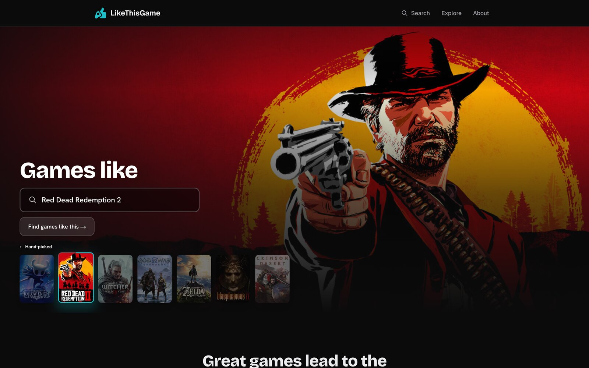
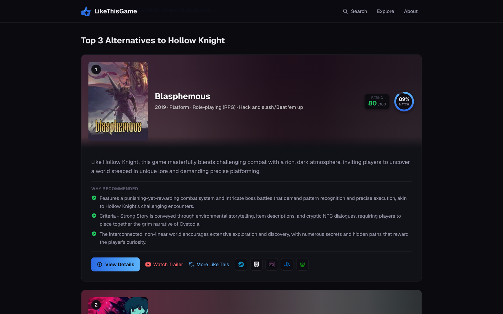
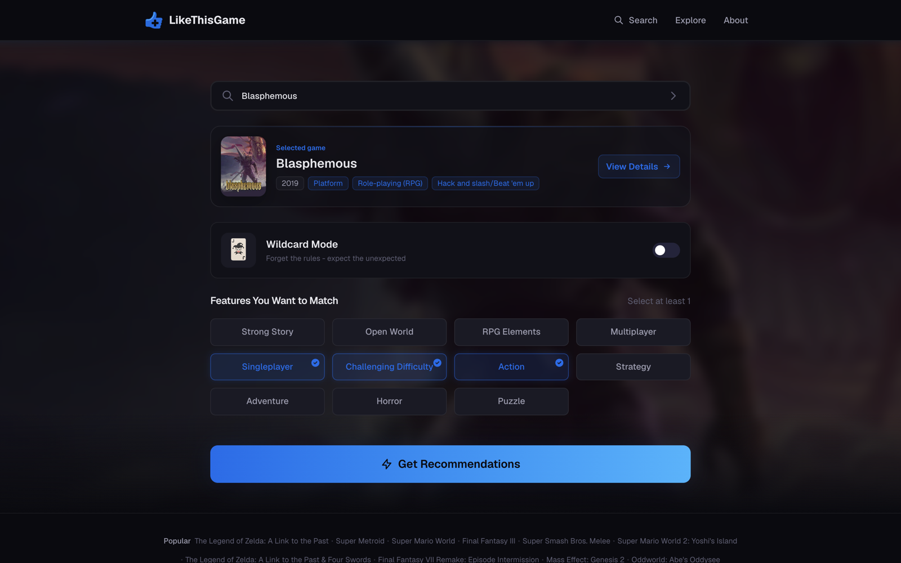
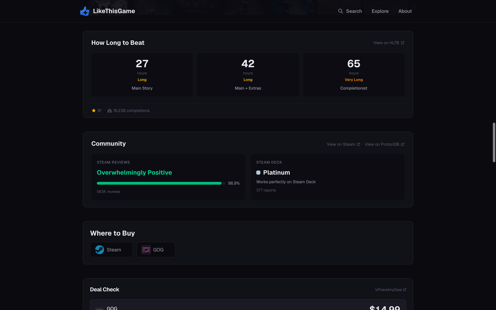
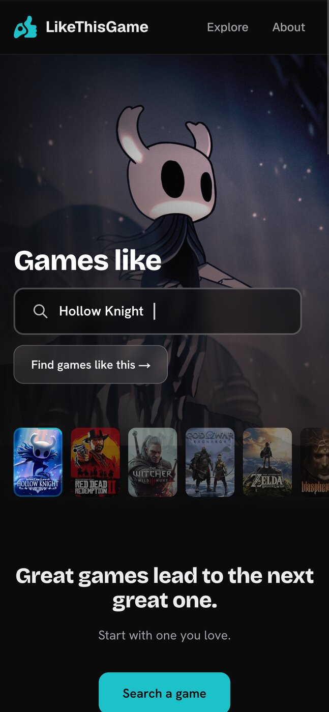
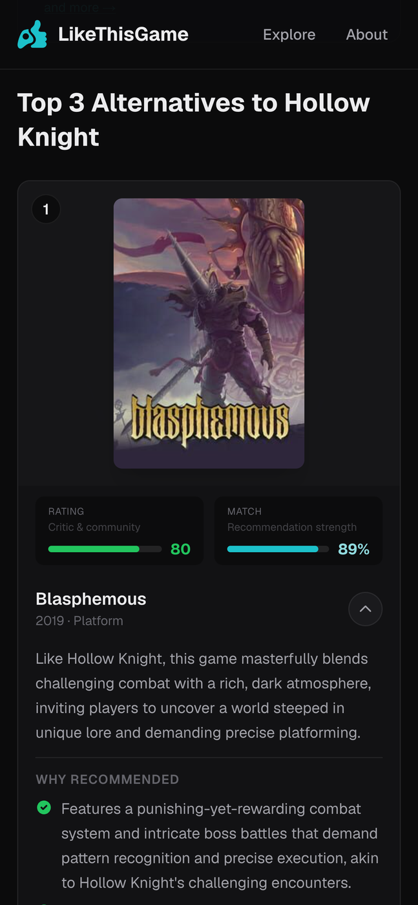
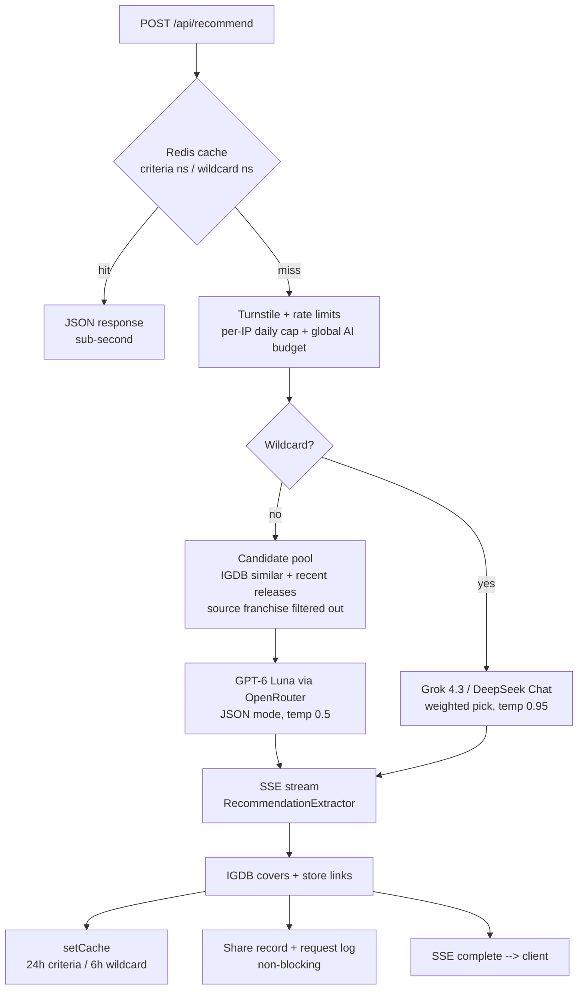

# likethisgame.com

**Find games you'll love. AI-powered recommendations based on games you enjoy.**

[Live Site](https://likethisgame.com)

## What is LikeThisGame?

Pick a game you love, choose what you want to match (story, difficulty, open world, multiplayer, and more), and get AI-picked alternatives streamed in real time. Every recommendation comes with a match score, the reasons it fits, IGDB cover art, trailers, and store links. It runs on IGDB's catalog, a self-hosted Next.js app, and Cloudflare in front, with a layered cost-protection system that keeps AI spend bounded.

| Recommendations | Criteria builder |
|---|---|
|  |  |

| Game detail page | Mobile |
|---|---|
|  |   |

## Stats

As of 2026-10-01:

| Metric | Value |
|--------|-------|
| Games in database | 64,000+ |
| Games with published recommendations | 17,400+ |
| Test suite | 227 files, 2,597 tests |

## Tech Stack

| Layer | Technology |
|-------|-----------|
| Framework | Next.js 16 (App Router, standalone output, Turbopack) |
| UI | React 19 + Tailwind CSS v4, token-based theme from a single TypeScript source |
| Database | SQLite (better-sqlite3, WAL mode) + Drizzle ORM |
| Cache | Redis (ioredis) + circuit breaker |
| AI (recommendations) | OpenAI GPT-6 Luna via OpenRouter, pinned provider routing |
| AI (baseline + intros) | Gemini 2.5 Flash baseline profile, Gemini 2.5 Flash Lite for SEO intro text |
| AI (Wildcard Mode) | Weighted split between Grok 4.3 and DeepSeek Chat |
| AI (offline ranking) | Jev (TypeSafe System One) typed judgments in the weekly content pipeline |
| Game data | IGDB, HowLongToBeat, IsThereAnyDeal, Steam reviews, ProtonDB, Twitch |
| Security | Cloudflare Turnstile + FingerprintJS v5 + Cloudflare WAF |
| Product analytics | Sentry + Umami Cloud + Microsoft Clarity |
| Observability | Prometheus + Loki + Alertmanager + Grafana, Uptime Kuma |
| Hosting | Hetzner CX33 + Coolify + Cloudflare (Full Strict TLS) |
| Asset delivery | Cloudflare R2 + Workers + Durable Objects |
| Testing | Vitest + React Testing Library + MSW + axe-core + Zod contract tests |

## Architecture

```mermaid
flowchart TD
    A[POST /api/recommend] --> B{Redis cache<br/>criteria ns / wildcard ns}
    B -- hit --> C[JSON response<br/>sub-second]
    B -- miss --> D[Turnstile + rate limits<br/>per-IP daily cap + global AI budget]
    D --> E{Wildcard?}
    E -- no --> F[Candidate pool<br/>IGDB similar + recent releases<br/>source franchise filtered out]
    F --> G[GPT-6 Luna via OpenRouter<br/>JSON mode, temp 0.5]
    E -- yes --> W[Grok 4.3 / DeepSeek Chat<br/>weighted pick, temp 0.95]
    G --> J[SSE stream<br/>RecommendationExtractor]
    W --> J
    J --> K[IGDB covers + store links]
    K --> L[setCache<br/>24h criteria / 6h wildcard]
    K --> M[Share record + request log<br/>non-blocking]
    K --> N[SSE complete --> client]
```

## Notable Engineering Decisions

- **SSE streaming with a custom JSON parser**: `RecommendationExtractor` tracks brace depth character by character and yields each recommendation as soon as the model finishes it, instead of waiting for the full response. If the provider fails mid-stream, the recommendations already received are kept as an uncached partial result.
- **Model choice by blind evaluation**: the recommendation model moved from Gemini to the GPT Luna family after a blind side-by-side eval showed better accuracy at a lower cost per request. Rollout is percentage-gated by env var, and each model profile has its own cache key version so a model swap never serves results from another model.
- **Provider-agnostic AI client**: one OpenAI SDK client with a `baseURL` override works across OpenRouter, direct Gemini, DeepSeek, and OpenAI. Provider routing and price caps are pinned per request.
- **Wildcard Mode**: a weighted pick between two models at elevated temperature (0.95 vs 0.50), with a system prompt that pushes cross-genre picks. It has its own cache namespace and client-side result state, so criteria and wildcard runs never overwrite each other.
- **Layered AI cost protection**: sliding-window rate limits (IP + fingerprint), a per-IP daily cap on new generations, a global daily AI budget (atomic Redis counter), criteria-combination dedup, fingerprint/IP anomaly detection, and invisible Turnstile that only runs on a cache miss. Budget checks fail closed when Redis is down.
- **Redis circuit breaker**: closed/open/half-open states. Redis outages degrade the app gracefully instead of taking it down.
- **Single-source design tokens**: every UI color, OG image, app icon, and the web manifest read one typed theme object, injected as CSS custom properties at the root layout. Glows and gradients are derived with `color-mix()`, so a palette only supplies base colors and switching it is a one-line change. A unit test fails CI on any raw hex, `rgb()`, or Tailwind palette class in app code.
- **Programmatic SEO**: ISR pages for every game and "games like" list, JSON-LD (VideoGame, ItemList, FAQPage, BreadcrumbList, AggregateRating, Offer), a split sitemap, and IndexNow pings. The personalized `/search` builder is `noindex` and never starts AI generation from a URL alone.
- **Weekly content pipeline**: a scheduled run seeds new releases, enriches tags, generates recommendation sets behind a quality gate that runs before any AI spend, mirrors images to R2, and notifies IndexNow. Jev scores each candidate for "same named series" and drops sequels a fan already knows, so lists surface discoveries instead of the obvious next entry.
- **Rich game detail pages**: How Long to Beat, Steam review summary, Steam Deck/ProtonDB status, store links with affiliate tracking (`rel="sponsored"`), IsThereAnyDeal prices and bundles, DLC, franchise, Twitch live streams, and language support. Each third-party source has its own Redis TTL and negative cache, and sections without data are hidden.
- **Edge asset delivery**: Next.js static assets ship from GitHub Actions to an R2-backed CDN host. IGDB images are served through a private R2 gate Worker; cache misses are coordinated by a Durable Object (`ImageOriginCoordinator`) that rate-limits origin fetches per crawler class. Worker changes go out as a 0% staged version, get smoke-tested, then are promoted.
- **Multi-layer scraper and crawler defense**: Cloudflare edge rules, an origin-side blocklist, page rate limits and burst detection, a honeypot link network, and an aggregate throttle for aggressive AI crawlers. AI training crawlers are blocked at the edge; AI search and retrieval bots stay allowed, so assistants can still cite the site.
- **CI/CD**: every push to `main` runs a serialized GitHub Actions pipeline: tests, Docker release artifacts, GHCR, a Coolify webhook, then deploy-ID and cache smoke checks with automatic Cloudflare purge. Docs-only pushes skip the deploy through path filters.
- **Self-hosted observability**: Prometheus (node, Redis, and a custom Cloudflare exporter), Loki via the Docker log driver, and unit-tested alert rules routed through Alertmanager to Telegram and email. A dead-man's switch pings Uptime Kuma, and origin certificate checks verify the chain and hostname, not just the expiry date. Grafana sits behind Cloudflare Tunnel + Access.
- **Verified backups**: database and Redis backups go offsite, and each database dump is test-restored and integrity-checked before upload.

## Agent-Ready

- **Content Signals** in robots.txt: `search=yes, ai-input=yes, ai-train=no`
- **llms.txt**: a Markdown manifest with AI usage preferences and machine-readable endpoints
- **Agent Skills discovery** (Cloudflare RFC v0.2.0): three skills (find-similar-games, get-game-details, search-games) with SHA-256 integrity digests
- **RFC 8288 Link headers** on the root URL: `describedby`, `sitemap`, `agent-skills`
- **Custom robots.txt route handler**: a typed route that supports directives Next.js `MetadataRoute.Robots` doesn't model

### Deferred on purpose

| Capability | Reasoning |
|------------|-----------|
| OAuth/OIDC discovery | The site has no OAuth provider. Publishing discovery metadata for auth paths that don't exist would mislead agents |
| Public API + RFC 9727 catalog | A stable agent-facing JSON contract conflicts with the scraper defense. Scoped for a future iteration with a designed gating model |
| MCP server card + endpoint | A server card without a backing endpoint would mislead MCP clients. Scoped for a dedicated server-side iteration |
| Markdown for Agents | Touches the request proxy (rate limiting, scraper defense, route guard). Scoped for a review cycle where defense changes can be validated on their own |
| WebMCP | Still behind a browser flag with a moving spec. Waiting for it to stabilize |

## Source Code

Source code is in a private repository. This repo is a public project overview.

## Author

**Mehmet Aras** — Senior Frontend Engineer
- [arasmehmet.com](https://arasmehmet.com)
- [LinkedIn](https://linkedin.com/in/arasmehmet7)
